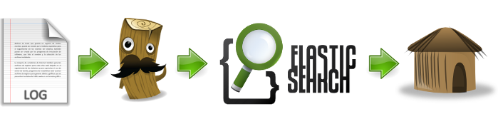

# Projecte 2016

## Centralització de logs JSON en BBDD i post-processat 

Jordi Amela

---

# Estructura

Logstash --> Elasticsearch --> Kibana

---

# Logstash

## fitxer de configuració

---

# Input
- Input: Entrada (un fitxer)

input {
  file {
   path => "/var/tmp/logstash-tutorial-dataset"
   path => "/var/log/messages"
   stat_interval => 2
   start_position => "beginning"
   sincedb_path => "/dev/null"
 }

---

# Output

- Output: Sortida (elasticsearch/Stdout)

output {
  elasticsearch {
    hosts => ["Elastic:9200"]
  }
    stdout { codec => rubydebug }
}

---

# Filter

- Filter: Processat

filter {
 
}
  grok {
         match => { "message" => "%{COMBINEDAPACHELOG}" }
  }
  geoip {
		source => "clientip"
  }
  date {
		match => [ "timestamp" , "dd/MMM/yyyy:HH:mm:ss Z" ]
  }
}

---

# plugins

són funcionalitats que aporten caracteristiques noves

Poden ser: 

- defecte
- descargable

## Atributs

- Valors per defecte 
- Obligats (Required)

---

# Elasticsearch

- Fitxer de configuració
- Eines gràfiques

---

# kibana

- Fitxer de configuració
- Entorn gràfic

---

# Gràfic kibana

- Visualització
- Ordenació
- Indexació

---

# Tecnologia Docker

## Idea

- Alliberar el host
- Funcionament de serveis automàtics

## Funcionament

- Imatges
- Contenidor
- Unió

---

# Dockerfile

## Que és

Personalització de imatge Docker

## Edició Dockerfile

Comandes especifiques: 

## Contenidor

Creat apartir de imatge Dockerfile

---

# Automatització

## Scripts

# Problemes principals

- Fitxer de configuració Logstash (plugin)
- Logstash container
- Volums i links
- Permisos dels fitxers

---

# Eines gràfiques

- Dues eines Elasticsearch (manipulació index i status)
- Post-processat

---

# Conclusió

Adminitració de logs està en desenvolupament 
Moltes eines noves per gestionar-los
La funció de tecnoligia docker

